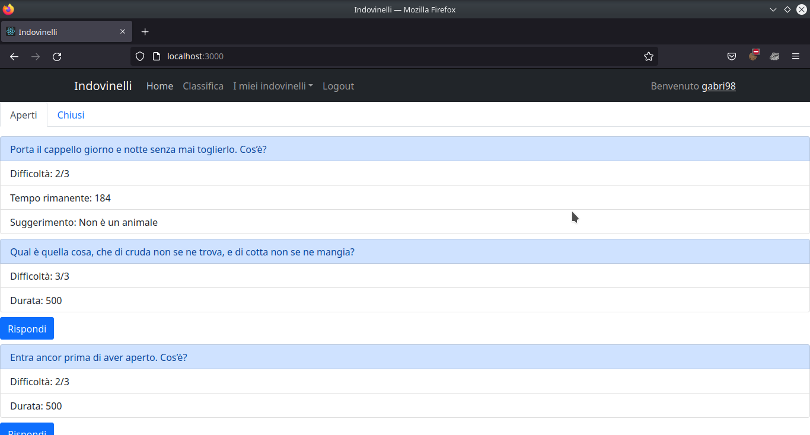

# Exam #2: "Indovinelli"
## Student: s296284 CASSETTA GABRIELE 

## React Client Application Routes

- Route `/`: per l'utente anonimo contiene la lista statica degli indovinelli pubblicati; per l'utente autenticato contiene la lista dinamica degli indovinelli divisi in aperti e chiusi con possibilità di rispondere.
- Route `/charts`: classifica contenente gli utenti coi 3 migliori punteggi
- Route `/myriddles`: lista dinamica degli indovinelli pubblicati dell'utente autenticato
- Route `/newriddle`: form per pubblicare un nuovo indovinello
- Route `/login`: form per l'autenticazione

## API Server
- GET `/api/riddlelist`
  - Nessun parametro nella richiesta.
  - La risposta contiene una lista minimale degli indovinelli in formato Json, con i soli campi id, state, question e difficulty
- GET `/api/riddles`
  - Nessun parametro nella richiesta.
  - La risposta contiene una lista completa degli indovinelli in formato Json, con tutti i campi. Il campo 'answer' è fornito solo per indovinelli chiusi o pubblicati dall'utente autenticato, altrimenti è undefined.
- GET `/api/charts`
  - Nessun parametro nella richiesta.
  - La risposta contiene la classifica completa degli utenti, fornendo i campi id e score. Sarà poi il client a filtrare la lista con i 3 migliori punteggi.
- GET `/api/answers`
  - Nessun parametro nella richiesta.
  - La risposta contiene tutte le risposte ad indovinelli chiusi o pubblicati dall'utente autenticato. Le risposte a indovinelli aperti non sono fornite.
- POST `/api/riddles`
  - La richiesta contiene i campi di un indovinello in formato Json, ovvero question, hint1, hint2 answer, difficulty, duration.
  - La risposta è un messaggio d'errore o successo.
- POST `/api/answers`
  - La richiesta contiene i campi di una risposta in formato Json, ovvero riddleid e text.
  - La risposta è un messaggio d'errore o successo.
- POST `/api/sessions`
  - La richiesta contiene le credenziali dell'utente-
  - La risposta è un messaggio d'errore o successo.
- DELETE `/api/sessions/current`
  - Nessun parametro nella richiesta.
  - Nessuna risposta.

## Database Tables

- Table `users` - Contiene i dati di un utente, ovvero id, hash e password, punteggio.
- Table `riddles` - Contiene i dati di ogni indovinello, compresa la data di invio della prima risposta (inizio del conto alla rovescia) e l'id del vincitore. L'id è un numero con autoincremento.
- Table `answers` - Contiene la risposta data da un certo utente (userid) a un certo indovinello (riddleid). Riddleid e userid sono chiave primaria.

## Main React Components

- `IndovinelliBar` (in `App.js`): Navbar principale con titolo, bottoni per la navigazione, e nome utente per l'utente autenticato.
- `Home` (in `Home.js`): contiene la lista statica degli indovinelli per l'utente anonimo.
- `LoggedHome` (in `LoggedHome.js`): contiene la lista dinamica degli indovinelli, divisi in aperti e chiusi, per l'utente autenticato
- `MyRiddles` (in `MyRiddles.js`): contiene la lista dinamica degli indovinelli pubblicati dall'utente autenticato.
- `RiddleForm` (in `PublishRiddle.js`): contiene il form per l'invio al server di un nuovo indovinello.
- `LoginForm` (in `LoginComponents.js`): contiene il form per l'autenticazione.

## Screenshot

## Users Credentials

- gabri98, password
- sfinge, password
- ciala03, password
- emre99, password
- anon, password
